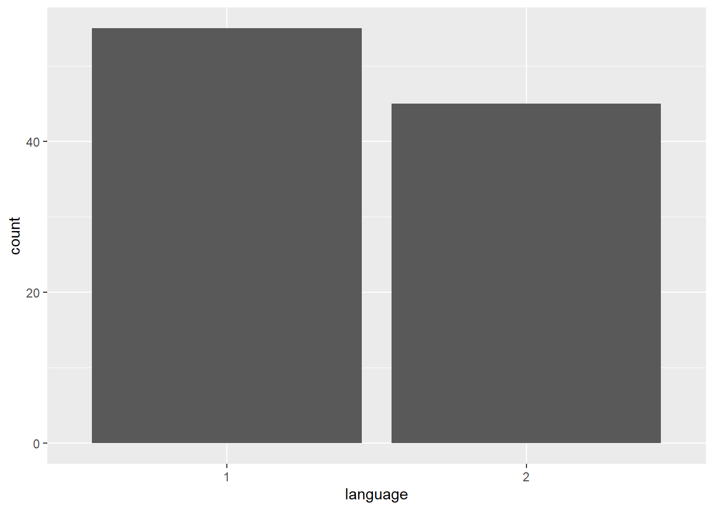
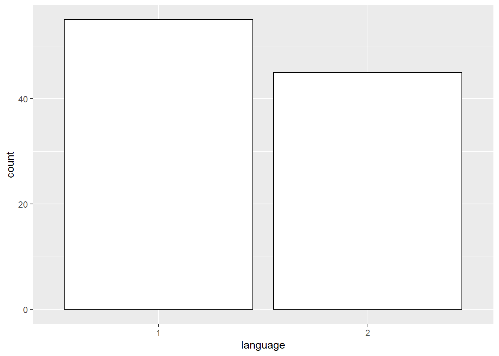
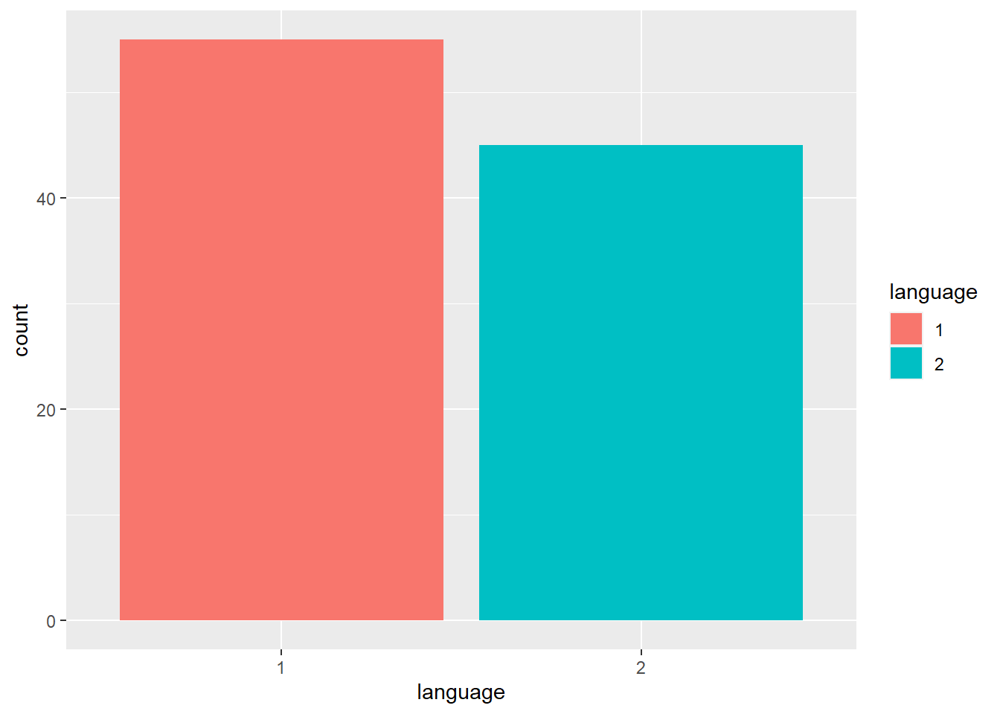
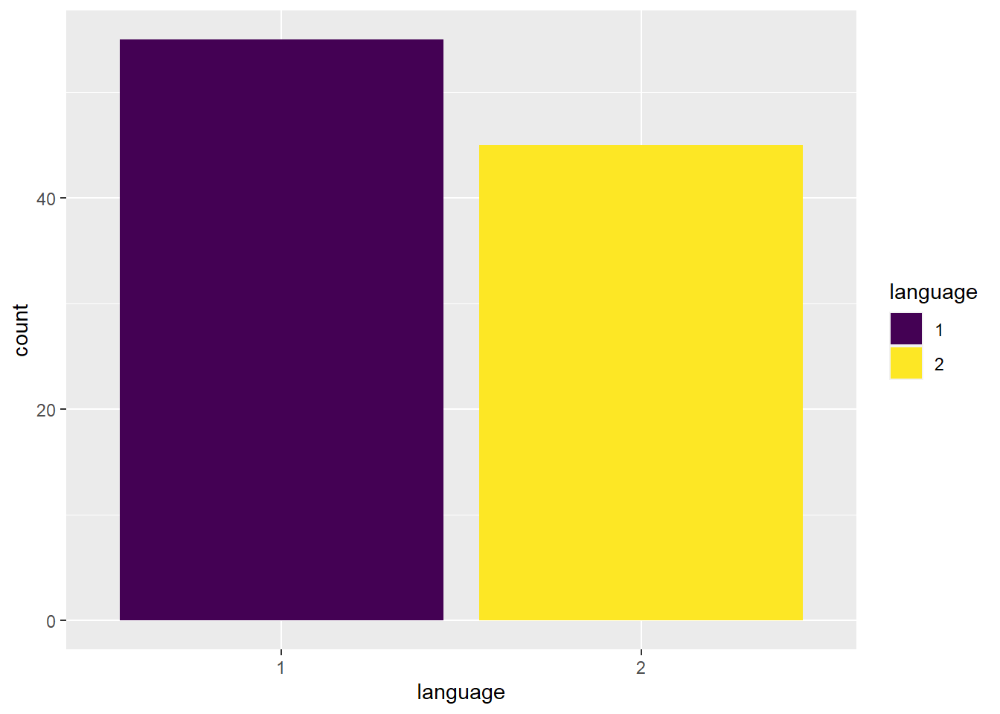
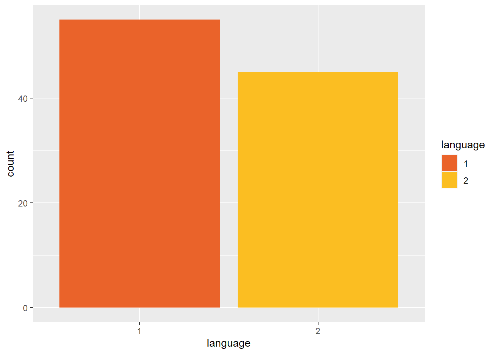
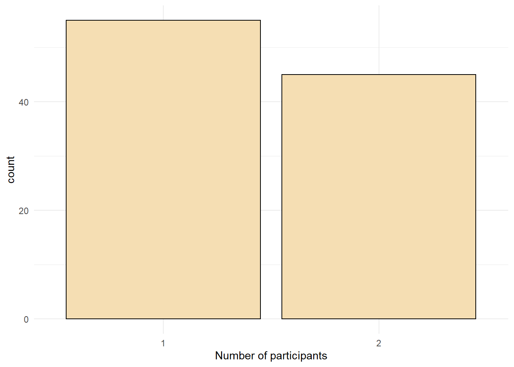

# Bar plots

Now that we have covered the basic principles of data visualisation and using ggplot2, we will move on to the different types of data visualisation and customisations of your plots. We will start with bar charts - please note that bar charts should only be used for count data, and should never be used to visualise means or distributions as they conceal a lot of important information about your data! 

## Bar chart of counts

For our first plot, we will make a simple bar chart of counts that shows the number of participants in each `language` group.


```r
ggplot(data = dat, aes(x = language)) +
  geom_bar()
```

<div class="figure" style="text-align: center">

<p class="caption">(\#fig:bar0)Bar chart of counts.</p>
</div>

The first line of code sets up the base of the plot.

-   `data` specifies which data source to use for the plot

-   `x` specifies which variable to put on the x-axis

The second line of code adds a `geom`, and is connected to the base code with `+`. In this case, we ask for `geom_bar()`. Each `geom` has an associated default statistic. For `geom_bar()`, the default statistic is to count the data passed to it. This means that you do not have to specify a `y` variable when making a bar plot of counts; R will automatically calculate counts of the groups in that variable. In this example, it counts the number of data points that are in each category of the `language` variable.

## Customisation 1

So far we have made basic plots with the default visual appearance. There are many ways in which you can control or customise the visual appearance of figures in R. The visual appearance of elements can be customised within a geom itself, within the aesthetic mapping, or by connecting additional layers with `+`. In this section, we look at the simplest and most commonly-used customisations: changing colours, adding axis labels, and adding themes.

### Changing colours

For our basic bar chart, you can control colours used to display the bars by setting `fill` (internal colour)  and `colour` (outline colour) inside the geom function. This method changes **all** bars.


```r
ggplot(data = dat, aes(x = language)) +
  geom_bar(fill= "white",
           colour= "black")
```

<div class="figure" style="text-align: center">

<p class="caption">(\#fig:bar1)Bar chart of counts.</p>
</div>

To change the colours based on a variable, you need to specify the `fill` argument inside the `aes` of your first layer (instead of the `geom` layer. If you want the outlines, you need to set the `colour` argument in the `aes` of the first layer.


```r
ggplot(data = dat, aes(x = language, fill=language)) +
  geom_bar()
```

<div class="figure" style="text-align: center">

<p class="caption">(\#fig:bar2)Fill set by a variable</p>
</div>

### Accessible colour schemes

One of the drawbacks of using `ggplot2` for visualisation is that the default colour scheme is not colour-blind friendly, and does not display well in greyscale. You can specify exact custom colours for your plots, but one easy option is to use a custom colour palette. These take the same arguments as their default `scale` sister functions for updating axis names and labels, but display plots in contrasting colours that can be read by colour-blind people and that also print well in grey scale. The `viridis` scale functions provide a number of different colour-blind and greyscale-safe options.


```r
ggplot(dat, aes(language, fill=language)) +
  geom_bar() +
  scale_fill_viridis_d(option="D")
```

<div class="figure" style="text-align: center">

<p class="caption">(\#fig:viridis)Use the viridis palette accessibility.</p>
</div>

The viridis palette has options for continuous (`scale_fill_viridis_c`) and discrete (`scale_fill_viridis_d`) scales, and there are different colour options from A-D. If you try and use the wrong version for the data you are working with, you will receive an error message. For example, changing the code above to `scale_fill_viridis_c(option="D")` will produce the error message "Error: Discrete value supplied to continuous scale" as you are trying to apply a continuous colour scale to discrete data. 
 
You can also manually choose the colours from within the viridis palette with the `begin` and `end` arguments (they range from 0 to 1). 


```r
ggplot(dat, aes(language, fill=language)) +
  geom_bar() +
  scale_fill_viridis_d(option="B", begin=0.65, end=0.85)
```

<div class="figure" style="text-align: center">

<p class="caption">(\#fig:viridis2)Setting viridis colours manually.</p>
</div>

### Adding a theme

`ggplot2` has a number of built-in visual themes that you can apply as an extra layer. The below code updates the x-axis and y-axis labels to the histogram, but also applies `theme_minimal()`. Each part of a theme can be independently customised, which may be necessary, for example, if you have journal guidelines on fonts for publication (you can find more information [HERE](https://psyteachr.github.io/introdataviz/additional-customisation-options.html)


```r
ggplot(dat, aes(language)) +
  geom_bar(fill = "wheat", color = "black") +
  scale_x_discrete(name = "Number of participants") +
  theme_minimal()
```

<div class="figure" style="text-align: center">

<p class="caption">(\#fig:bar-theme)Bar chart with a custom theme.</p>
</div>
