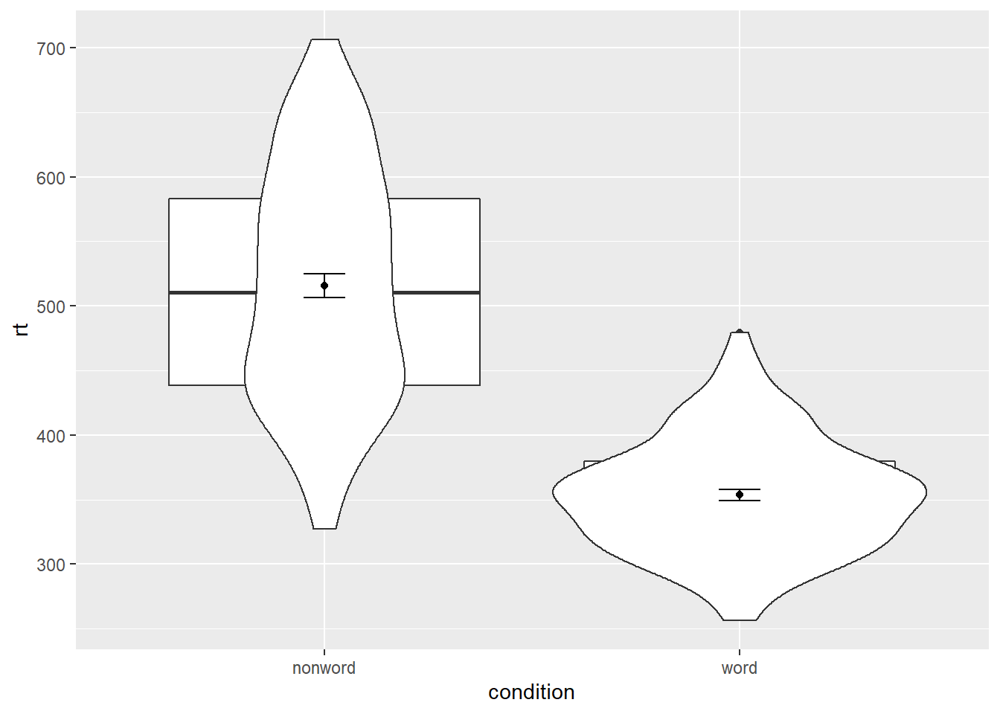

# Violin-boxplots

The power of the layered system for making figures is further highlighted by the ability to combine different types of plots. For example, rather than using a bar chart with error bars, you can easily create a single plot that includes the density of the distribution, confidence intervals, means and standard errors. In the below code, we first draw a violin plot, then layer on a boxplot, a point for the mean (note `geom = "point"`) and standard error bars (`geom = "errorbar"`).

-   `fatten = NULL` in the boxplot geom removes the median line, which can make it easier to see the mean and error bars. Including this argument will result in the message `Removed 1 rows containing missing values (geom_segment)` and is not a cause for concern. Removing this argument will reinstate the median line.


```r
ggplot(dat_clean, aes(x = condition, y= rt)) +
  geom_violin() +
  # remove the median line with fatten = NULL
  geom_boxplot(width = .2, 
               fatten = NULL) +
  stat_summary(fun = "mean", geom = "point") +
  stat_summary(fun.data = "mean_se", 
               geom = "errorbar", 
               width = .1)
```

<div class="figure" style="text-align: center">

<p class="caption">(\#fig:viobox1)Violin-boxplot with mean dot and standard error bars.</p>
</div>

It is important to note that the order of the layers matters and it is worth experimenting with the order to see where the order matters. For example, if we call `geom_boxplot()` followed by `geom_violin()`, we get the following mess:


```r
ggplot(dat_clean, aes(x = condition, y= rt)) +
  geom_boxplot() +  
  geom_violin() +
  stat_summary(fun = "mean",  geom = "point") +
  stat_summary(fun.data = "mean_se", 
               geom = "errorbar", 
               width = .1)
```

<div class="figure" style="text-align: center">

<p class="caption">(\#fig:viobox1b)Plot with the geoms in the wrong order.</p>
</div>

### Grouped violin-boxplots

We can map multiple variables in the violin-boxplot with the `fill` argument for the violin-boxplot. However, simply adding `fill` to the mapping causes the different components of the plot to become misaligned because they have different default positions:


```r
ggplot(dat_clean, aes(x = condition, y= rt, fill = language)) +
  geom_violin() +
  geom_boxplot(width = .2, 
               fatten = NULL) +
  stat_summary(fun = "mean",  geom = "point") +
  stat_summary(fun.data = "mean_se", 
               geom = "errorbar", 
               width = .1)
```

<div class="figure" style="text-align: center">

<p class="caption">(\#fig:viobox2)Grouped violin-boxplots without repositioning.</p>
</div>

To rectify this, we need to adjust the argument `position` for each of the misaligned layers. `position_dodge()` instructs R to move (dodge) the position of the plot component by the specified value; finding what value looks best can sometimes take trial and error. 


```r
# set the offset position of the geoms
pos <- position_dodge(0.9)

ggplot(dat_clean, aes(x = condition, y= rt, fill = language)) +
  geom_violin(position = pos) +
  geom_boxplot(width = .2, 
               fatten = NULL, 
               position = pos) +
  stat_summary(fun = "mean", 
               geom = "point", 
               position = pos) +
  stat_summary(fun.data = "mean_se", 
               geom = "errorbar", 
               width = .1,
               position = pos)+
  scale_fill_viridis_d(option="B", begin=0.5, end=0.8)
```

<div class="figure" style="text-align: center">

<p class="caption">(\#fig:viobox3)Grouped violin-boxplots with repositioning.</p>
</div>

## Storing plots

Just like with datasets, plots can be saved to objects. The below code saves the histograms we produced for reaction time and accuracy to objects named `p1` and `p2`. These plots can then be viewed by calling the object name in the console.


```r
p1 <- ggplot(dat_clean, aes(x = rt)) +
  geom_histogram(binwidth = 10, color = "black")

p2 <- ggplot(dat_clean, aes(x = acc)) +
  geom_histogram(binwidth = 1, color = "black") 
```

Importantly, layers can then be added to these saved objects. For example, the below code adds a theme to the plot saved in `p1` and saves it as a new object `p3`. This is important because many of the examples of `ggplot2` code you will find in online help forums use the `p +` format to build up plots but fail to explain what this means, which can be confusing to beginners.


```r
p3 <- p1 + theme_minimal()
```

## Saving plots as images

In addition to saving plots to objects for further use in R, the function `ggsave()` can be used to save plots as images on your hard drive. The plot will be saved to your current working directory, unless you specify an alternative location such as a folder within your current working directory. 

The only required argument for `ggsave` is the file name of the image file you will create, complete with file extension (this can be "eps", "ps", "tex", "pdf", "jpeg", "tiff", "png", "bmp", "svg" or "wmf"). By default, `ggsave()` will save the last plot displayed. However, you can also specify a specific plot object if you have one saved.


```r
ggsave(filename = "my_plot.png") # save last displayed plot

ggsave(filename = "my_plot.png", plot = p3) # save plot p3
```

The width, height and resolution of the image can all be manually adjusted. Fonts will scale with these sizes, and may look different to the preview images you see in the Viewer tab. The help documentation is useful here (type `?ggsave` in the console to access the help).
